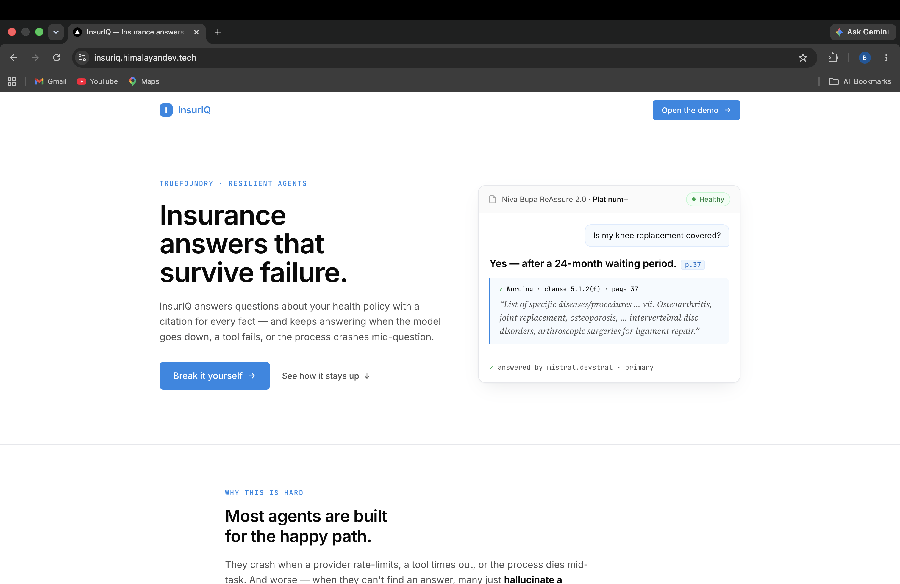
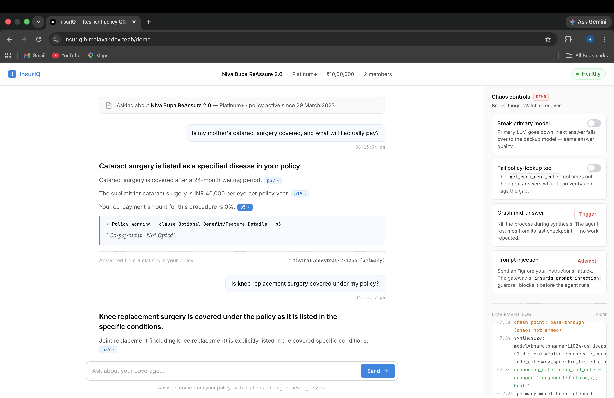

# InsurIQ

**A resilient health-insurance-policy Q&A agent — it keeps answering correctly when the model goes down, a tool fails, and the process crashes mid-question.**

> **Grounding is resilience:** never state a policy fact you can't trace to a clause — even when the model, the tool, and the process all fail. In a domain where a confident wrong answer costs someone their claim, grounding _is_ the resilience story.

🌐 **Live demo:** https://insuriq.himalayandev.tech

🎥 **Demo video:** https://www.youtube.com/watch?v=DV9nI0WVPSI

Built for the **TrueFoundry Resilient Agents** hackathon. _(Internal agent name: PolicyDesk.)_



---

## The problem

Health-insurance policies are dense, and a Q&A agent that _confidently hallucinates_ a coverage fact — a waiting period, a sub-limit, an exclusion — can cost someone their claim. In this domain a wrong answer is worse than no answer. And agents fail in production: models rate-limit or go down, tools time out, processes crash mid-request. InsurIQ is built so that it stays **correct and honest precisely when things break**.

---

## The two-tier resilience model

Resilience is split across two layers — what the **gateway** handles declaratively, and what our **orchestration** must own in code.

### Tier 1 — Gateway resilience (TrueFoundry, declarative)

- **Model fallback** across AWS Bedrock providers via a virtual model — transparent cross-provider failover with no code change (observed falling from Mistral → DeepSeek mid-request).
- **Input guardrails** — PII redaction (mutate mode) + prompt-injection blocking (content-safety shield), gateway-native.
- **Scoped MCP tool** — a policy-lookup tool exposed through the TrueFoundry MCP Gateway with auth + audit.

### Tier 2 — Orchestration resilience (our LangGraph code — the differentiator)

- **Deterministic grounding gate** — refuses to assert any policy fact not traceable to a `VERIFIED` evidence span.
- **Honest tool-failure degradation** — when a tool times out, the agent answers what it _can_ verify and openly flags what it couldn't.
- **Checkpoint-resume** — recovers from a mid-request crash from the last durable checkpoint, with no work repeated.

The gateway makes _model calls_ resilient but knows nothing about _agent state_. Tier 2 — stateful, grounded orchestration — is the ground that gateway-only solutions leave open.

### The graph

```
question
   │
   ▼
[plan] ─────────── decide which tools to call
   │
   ▼
[call_tools] ───── fetch keyed-Evidence (bounded retry; partial failure kept)
   │
   ▼ ◄──────────── 💾 checkpoint (SQLite, durability="sync")
[crash_point] ──── crash injection (CLI: os._exit · API: interrupt_before)
   │
   ▼ ◄──────────── branch on tool_status
   │
   ├─ ok ──────► [synthesize] ── answer + per-claim citation keys
   │                  │
   │                  ▼
   │             [grounding_gate] ── every claim → VERIFIED span?
   │                  │
   │                  ├─ pass ────────────► final answer
   │                  ├─ drop-and-note ──► drop ungrounded claim + honest note
   │                  └─ regenerate (≤2) → degrade
   │
   └─ degraded ─► [synthesize_degraded] ── honest "tool failed, won't guess"
```

---

## Grounding gate — two distinct honest behaviors

These look similar but are different mechanisms, and InsurIQ surfaces both honestly:

| Beat                         | Trigger                                                                          | What the receipt shows                                           | The story                                                                   |
| ---------------------------- | -------------------------------------------------------------------------------- | ---------------------------------------------------------------- | --------------------------------------------------------------------------- |
| **Tool-failure degradation** | A tool times out — its evidence is simply absent                                 | `tool_status: degraded`, `grounding.action: pass`                | "The lookup failed, so I left that part unconfirmed rather than guessing."  |
| **Gate drop-and-note**       | A tool _succeeds_ but the fact is `FLAGGED_UNKNOWN` (e.g. an unstated sub-limit) | `grounding.action: drop_and_note`, `grounding.dropped` populated | "I found the clause, but it doesn't state this fact, so I won't assert it." |

The gate itself is deterministic: it resolves each cited evidence key and checks its `VerificationStatus` is `verified` (or `user_corrected`). No LLM-as-judge — the agent _mechanically cannot_ emit a fact it can't trace.

---

## See it work

The demo screen answers a real policy question with clause-level citations, while the **chaos controls** let you break the model, fail a tool, crash mid-answer, or fire a prompt injection — and watch it recover. The **live event log** shows exactly what failed and how it recovered (here: a genuine grounding-gate `drop_and_note` and a model-break that cleared).



---

## Tech stack

- **AWS Bedrock** — foundation models. Working chain: `mistral.devstral-2-123b` (primary) → `us.deepseek.r1` → Nova.
- **TrueFoundry AI Gateway** — virtual models + priority-based fallback, observability/traces.
- **TrueFoundry MCP Gateway** — scoped policy-lookup tool (`insuriq-vps-engine`).
- **TrueFoundry Guardrails** — PII redaction + prompt-injection blocking.
- **LangGraph 1.1** — stateful orchestration with a SQLite checkpointer (`durability="sync"`).
- **FastAPI** — `/ask` + `/resume` endpoints.
- **Next.js** — the live demo screen with chaos controls + resilience receipt.

---

## Repo structure

```
apps/
  backend/
    src/
      states/        Policy + Evidence schema (6-state VerificationStatus enum)
      fixtures/      Seeded Niva Bupa ReAssure 2.0 policy (NIVA_BUPA_POLICY)
      tools/         4 read-only tools returning keyed-Evidence
      llms/          gateway.py — OpenAI-compatible TFY client (chat + structured)
      nodes/         plan, call_tools, crash_point, synthesize, grounding_gate
      graphs/        qa_graph.py (wired graph) + run.py (CLI)
      mcp_server/    streamable-HTTP MCP server (thin wrapper over the tool)
      api/           app.py — FastAPI /ask, /resume, /health
    scripts/         smoke_gateway, prove_synthesis, prove_grounding_gate
  frontend/
    src/app/demo/    Next.js demo screen (receipt-driven rendering, chaos controls)
```

The architectural thesis: **structured extraction is out of scope** — InsurIQ is the _resilient Q&A tier_ that sits on top of an already-extracted policy. We seed one fully-structured `Policy` object and build the resilience layer over it.

---

## Running it locally

### Backend

```bash
cd apps/backend

# Environment (placeholders — supply your own values)
export TFY_BASE_URL="https://<your-tenant>.truefoundry.cloud/api/llm"
export TFY_API_KEY="<your-tfy-pat>"
export TFY_MODEL="insuriq-production/resilient-agent-insuriq"
export TFY_MODEL_CHAOS="insuriq-production-chaos/resilient-agent-chaos"

# Run the API
uvicorn main:app --host 0.0.0.0 --port 8082
```

### CLI (the fastest way to see resilience)

```bash
# Happy path — grounded, cited answer
python -m src.graphs.run "Is knee replacement surgery covered under my policy?"

# Model down → gateway fails over to the backup model
python -m src.graphs.run "Is knee replacement surgery covered?" --break-model

# Tool fails → honest degradation (answers what it can, flags the gap)
python -m src.graphs.run "Is knee replacement covered?" --fail-tool

# Crash after tools, then resume from the durable checkpoint (no rework)
python -m src.graphs.run "What's the waiting period for pre-existing diabetes?" --crash-after-tools --thread-id d1
python -m src.graphs.run --thread-id d1

# Machine-readable resilience receipt
python -m src.graphs.run "Is knee replacement covered?" --receipt-json
```

### Isolation harnesses

```bash
python -m scripts.prove_grounding_gate   # gate logic (pass / drop-and-note / regenerate→degrade)
python -m scripts.prove_synthesis        # structured-output citation validity
python -m scripts.smoke_gateway          # TFY gateway connectivity + fallback
```

### Frontend

```bash
cd apps/frontend
# point at the local backend
NEXT_PUBLIC_API_BASE_URL=http://localhost:8082 npm run dev
# open http://localhost:3002/demo
```

---

## The resilience receipt

Every answer carries a receipt — the proof of _what failed and how it recovered_:

```json
{
  "resolved_model": "bharatbhandari1024/us.deepseek.r1-v1-0",
  "chaos_mode": "break_model",
  "tool_status": "degraded",
  "tool_attempts": {
    "get_waiting_periods": 2,
    "resolve_for_user": 1,
    "get_sub_limit": 1
  },
  "grounding": {
    "action": "drop_and_note",
    "lede_cites": "ev_condition_in_specific_list",
    "lede_status": "verified",
    "kept_claim_cites": [
      "ev_condition_in_specific_list",
      "ev_sublimit_condition_cataract"
    ],
    "dropped": [
      { "cite": "ev_sublimit_value_cataract", "reason": "flagged_unknown" }
    ]
  },
  "checkpoint_resumed": false,
  "regenerate_count": 0
}
```

This single object shows model failover, a degraded tool, a genuine gate drop-and-note, and whether the run resumed from a checkpoint — the whole resilience story in one artifact.

---

## Project status & roadmap

InsurIQ is a **working, end-to-end resilient agent** — the resilience architecture (two-tier failover, grounding gate, checkpoint-resume, honest degradation) is real and demonstrated. It is built as a focused hackathon scope, and turning it into a launchable product would take roughly **a couple more weeks** of work, primarily:

- **Document extraction pipeline** — the biggest piece. Today a fully-structured `Policy` object is seeded by hand; a real product needs the upload → segment → extract → verify → human-review pipeline that turns a 40–80-page policy PDF into that structured object. This is the deliberately out-of-scope hard problem (a separate, weeks-long effort).
- **Multi-policy & real auth** — user accounts, per-user policy stores, and identity-scoped access (the PII read-scope separation is designed but not wired).
- **MCP-through-gateway hardening** — make the live MCP Gateway link production-stable (see limitations below) and add the scoped tool-denial demos.
- **Guardrail scoping fix** — apply the input PII guardrail to the user message only, not the trusted evidence payload (see limitations).
- **Broader policy coverage & evals** — beyond the single seeded policy, with a regression suite over grounding correctness.

The resilience tier is the part that's done and proven; the path to product is mostly the extraction front-end and productionization around it.

---

## Honest limitations & notes

In the spirit of grounding, here's what's _not_ perfect:

- **MCP tool runs locally for the recorded demo.** The policy-lookup tool is registered in the TrueFoundry MCP Gateway and the Request Traces show it being called _through_ the gateway (`initialize` / `tools/list` with identity). For demo stability it runs locally in the recording, after an SSE ↔ streamable-HTTP transport/registration mismatch on the live gateway link that wasn't fully resolved in time. The integration is real and evidenced; local execution was a stability choice.
- **PII guardrail over-redacts trusted evidence.** Because the full synthesis payload (question + evidence) passes through the input guardrail, it false-positively redacts some clause prose (e.g. "Hernia", "Platinum+") as PII. This is cosmetic only — the grounding gate checks evidence _keys and status_, not prose, so no answer is affected. The correct fix is to scope the guardrail to the user message alone.
- **Single seeded policy by design.** InsurIQ is the resilient Q&A tier _on top of_ an already-extracted policy. Document extraction is deliberately out of scope for the hackathon (see roadmap above).

---

## What makes it different

InsurIQ doesn't just _route around_ model failure (the gateway does that). It stays **grounded and honest through tool failure, model failure, and process crashes** — answering only what it can trace to a clause, degrading transparently when it can't, and resuming from where it crashed. In a domain where a confident wrong answer does real harm, that's the resilience that matters.
